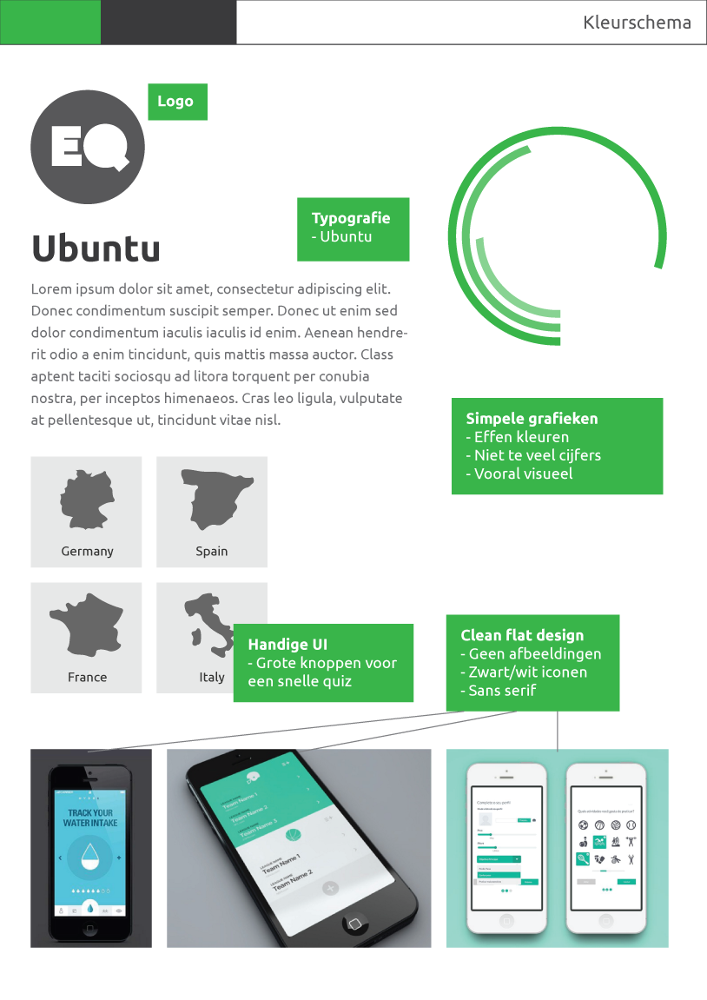
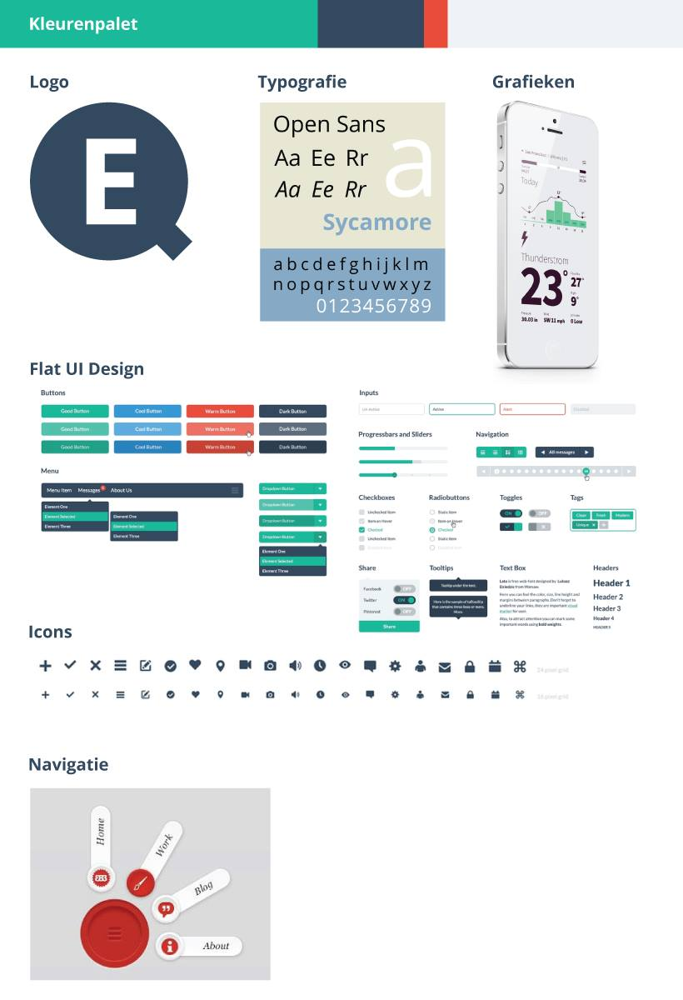
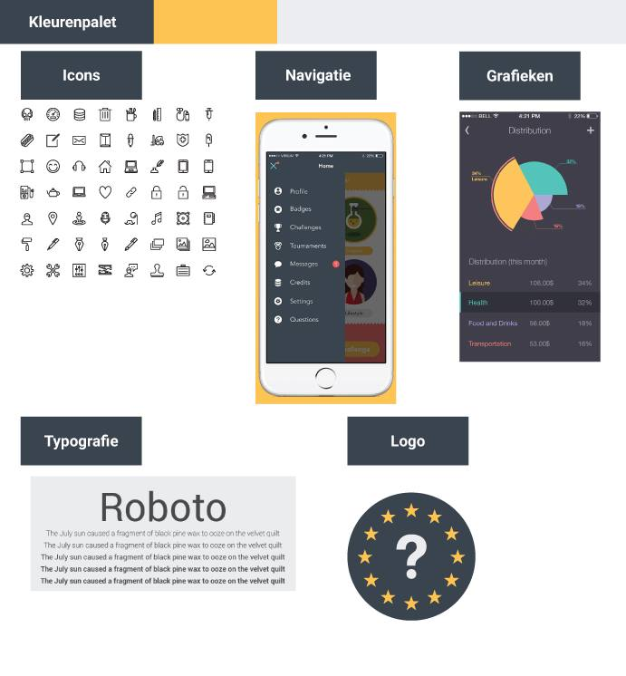

EuroQuiz
========

Briefing en analyse
-------------------

EuroQuiz is een webapplicatie die langs de ene kant data weergeeft over de landen in Europa (oppervlakte, belastingen).  
Ook is er de mogelijkheid van het spelen van een quiz. Een quiz waarbij je wordt beoordeeld op snelheid, maar ook correctheid van de twintig antwoorden. Nadien is het mogelijk je antwoorden te bekijken, en ook je score te delen via facebook of twitter.

Technische specificaties
------------------------

### Webtechnologieën

De app zal geschreven worden in HTML5, CSS3, en JavaScript. Voor de CSS zal een preprocessor (Sass) gebruikt worden.

### Datasets

Volgende datasets zullen geïntegreerd worden in de app:
* [Land area](http://data.worldbank.org/indicator/AG.LND.TOTL.K2)
* [Forest area](http://data.worldbank.org/indicator/AG.LND.FRST.ZS)
* [Internet users](http://data.worldbank.org/indicator/IT.NET.USER.P2)
* [Motor vehicles](http://data.worldbank.org/indicator/IS.VEH.NVEH.P3)
* [Total tax rate](http://data.worldbank.org/indicator/IC.TAX.TOTL.CP.ZS)
* Pump price for fuel
	* [Pump price for diesel](http://data.worldbank.org/indicator/EP.PMP.DESL.CD)
	* [Pump price for gasoline](http://data.worldbank.org/indicator/EP.PMP.SGAS.CD)
* Employment
	* [Female employment](http://data.worldbank.org/indicator/SL.EMP.TOTL.SP.FE.ZS)
	* [Male employment](http://data.worldbank.org/indicator/SL.EMP.TOTL.SP.MA.ZS)
* [Water withdrawel](http://data.worldbank.org/indicator/ER.H2O.FWTL.ZS)

### Inladen van de quizvragen

De quizvragen zullen ingeladen worden door middel van een zelfgeschreven JSON. Uit die JSON zullen dan 20 random vragen gekozen worden, waarbij de antwoorden ook in random volgorde zullen staan.

### Bewaren van de topscores

De topscores van de gebruiker zullen opgeslagen worden door gebruik te maken van local storage.

Persona's
---------

| Vincent | | 
|---|---| 
| Naam 		| Vincent Decoster 				| 
| Leeftijd 	| 29 							| 
| Woonplaats| Limburg						| 
| Beroep 	| Treinmachinist				| 
| Hobby's 	| Hardlopen en gitaar spelen 	| 
| Thuis		| Alleenstaand 					| 
| 			| Vincent is een rustige en creatieve man. Hij heeft een iPhone 5 die handig uitkomt wanneer hij moet wachten op zijn shift op het werk. Dan kan hij sociale media checken en ook enkele spelletjes spelen. |

| Sarah | |
|-------|---|
| Naam 		| Sarah Hesseling 				| 
| Leeftijd 	| 35							| 
| Woonplaats| Oostenrijk					| 
| Beroep 	| Huismoeder					| 
| Hobby's 	| Tekenen 						| 
| Thuis		| Getrouwd, 2 kinderen			| 
| 			| Sarah zorgt goed voor haar kinderen nu ze haar baan heeft opgezegd. Ze houdt haar overdag bezig met huishoudelijke taken, en 's avonds zakt ze samen met haar man onderuit in de zetel voor de TV. Ze heeft een Samsung Galaxy Mini, waar ze regelmatig het nieuws mee checkt.|

| Mike | |
|---|---| 
| Naam 		| Mike Statts 				    | 
| Leeftijd 	| 19							| 
| Woonplaats| Verenigd Koninkrijk			| 
| Beroep 	| Student						| 
| Hobby's 	| Uitgaan 						| 
| Thuis		| Alleenstaand					| 
| 			| Mike is vaak te vinden bij zijn vrienden. Hij houdt van uitgaan en is alles behalve rustig. Hij is erg slim, waardoor hij niet veel moet studeren en veel vrije tijd heeft. Op de trein en op de bus houdt hij zich regelmatig bezig op zijn nieuwe iPhone 6 Plus.|

Moodboards
----------

---

---

Sitemap
-------

Wireframes
----------

Style tiles
-----------

---

